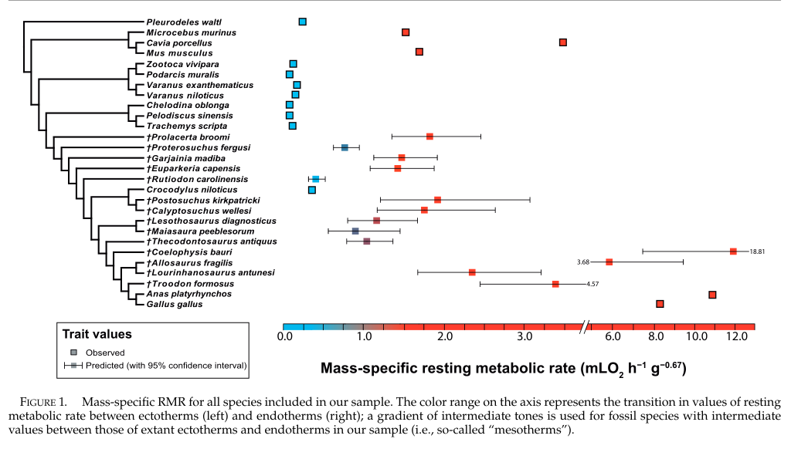
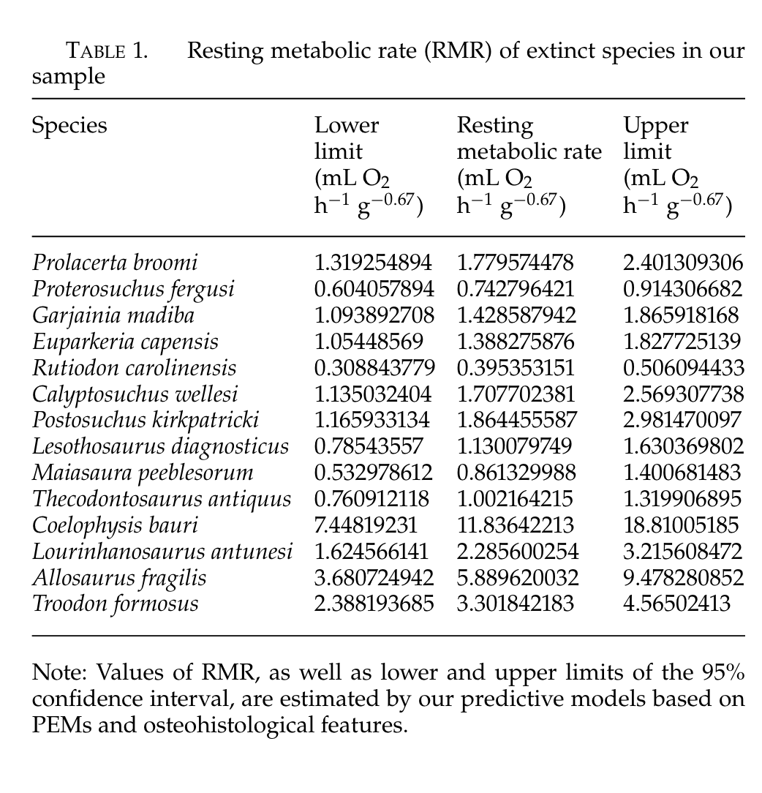

#  *PROJECT NOT YET COMPLETED loading up PDF and imnages now

#   Introduction*

# *OBJECTIVE:*

The overall objective of Legendre et al., 2016 was to estimate metabolic rates of fossil archosauromorphs (a major group of diapsids, differentiated from the other diapsids by the presence of single openings in each side of the skull, in front of the eyes, among other characteristics) by performing a statistical predictive model using a new method of phylogenetic eigenvector maps on a set of bone histological features for a sample of extant and extinct vertebrates.


# TYPES OF *DATA COLLECTED:*

The models were built using 57 specimens belonging to 14 extant species and 14 extinct species of tetrapods.

Resting metabolic rates (RMR values) are taken from Montes et al. (2007), where growth rate was taken from juvinile specimens in vivo. (All variables, such as histological characters and metabolic were taken from the same specimen.) Bone histology sections were used for obtaining the following measurements: vascular density, osteocyte density, osteocyte shape, and osteocyte area—on each bone.

Phylogeny relationships, topology and branch length, a well as inner relationships were all taken from published sources (Cubo et al. (2012), Legendre et al. (2013), Benton et al. 2015), Conrad (2008), Joyce et al. (2013),  Nesbitt (2011), and Crawford et al. (2015)).


# The *MAIN RESULTS* of the paper showed:

1) that Mesozoic theropod dinosaurs exhibit metabolic rates very close to those found in modern birds
2) that archosaurs share a higher ancestral metabolic rate than that of extant ectotherms
3)that this derived high metabolic rate was acquired at a much more inclusive level of the phylogenetic tree, among non-archosaurian archosauromorphs.

Additionally, these results highlight the difficulties of assigning a given heat production strategy, such as endothermy or ectothermy, to an estimated metabolic rate value. The results of the paper also confirmed findings from previous studies which state that the definition of the endotherm/ectotherm dichotomy may be ambiguous.

# *ANALYSIS* DONE:


The PEM approach was selected to estimate mass-specific RMR (in mL O2 h−1 g−0.67 ) in this study, using bone histological data and phylogenetic information to convert the phylogeny into PEMs and predict values of the dependent variable for fossil species.
Three predictive models were done for each of the three elements (femur, humerus, and tibia), to maintain a strict frame of homology.
Ancestral states of RMR were reconstructed from both observed and predicted values, using a phylogeny of the complete sample.

# *ANALYSIS REPLICATED*

Visualization:

Here I replicated the sepratate components of Figure 1. Separate images have been coded below as the original work was tied together using a program other than R. 

The data analysis I replicated the was done in order to reconstruct the ancestral states of RMR from both observed and predicted values by using a phylogeny of the complete sample. 


These are the packages that I used for this replication:
```{r}
library(TreeTools)
library(ape)
library(ggplot2)
library(tidyverse)
library(ggtree)
library(BiocManager)
library(ggtree)
library(phytools)
library(maps)
library(gridExtra)
library(MPSEM)
library(evobiR)
library(Metrics)


library(AICcmodavg)
library(caper)
library(dplyr)
library(nlme)
library(nortest)
library(RColorBrewer)
```

#  *Visualization of Data*

Legendre et al., 2016 has made their data available at "https://datadryad.org/stash/dataset/doi:10.5061/dryad.2853k".

The following data files were downloaded from Dryad to my computer: femurfilemeta.txt, humerusfilemeta.txt, tibiafilemeta.txt, Treecomplete.trees.nex, TreefemurMeta.nex,TreehumerusMeta.nex, TreetibiaMeta.nex.


I downloaded the filed from Dryad and saved them into a local directory (folder) called "DATA" in my repo.The files then loaded into R through my directory as indicated below. I titled each data by the bone it refers to and viewed the head of the data.


```{r}

f<- "/Users/jessicavaldes/Desktop/R2024/FINAL.PROJECT/tibiafilemeta.txt"

tibia <- read.delim(f, stringsAsFactors = FALSE, fileEncoding = "latin1")

head(tibia)

f<- "/Users/jessicavaldes/Desktop/R2024/FINAL.PROJECT/humerusfilemeta.txt"

humerus <- read.delim(f, stringsAsFactors = FALSE, fileEncoding = "latin1")

head(humerus)

f<- "/Users/jessicavaldes/Desktop/R2024/FINAL.PROJECT/femurfilemeta.txt"

femur <- read.delim(f, stringsAsFactors = FALSE, fileEncoding = "latin1")

head(femur)
```

Here I have loaded the tree data  by reading the NEXUS file and naming them by the component (tibia, humerus, femus, or complete) and adding "tree" in the name.

Additional trees I have replicated that are not found in any figures on the paper can be found below in the "Extra" section.

```{r}
tibiatree <- read.nexus(file = "/Users/jessicavaldes/Desktop/R2024/Final.Project2024/DATA/TreetibiaMeta.nex")

head(tibiatree)

humerustree <- read.nexus(file = "/Users/jessicavaldes/Desktop/R2024/Final.Project2024/DATA/TreehumerusMeta.nex")

head(humerustree)

femurtree <- read.nexus(file = "/Users/jessicavaldes/Desktop/R2024/Final.Project2024/DATA/TreefemurMeta.nex")

head(femurtree)

completetree <- read.nexus(file =   "/Users/jessicavaldes/Desktop/R2024/Final.Project2024/DATA/Treecomplete.trees.nex")

head(completetree)


```

# COMPLETE TREE:
Here I start replicating the complete tree show in in Figure 1 of the paper.
I made sure the NEXUS file was loaded.

I converter the complete tree into a phylo object.

I plotted the phylo tree using ggtree, add tip labels (shows the species name in this case) and apply a tree-like theme, and name it Main Tree

```{r}

completetree <- read.nexus(file = "/Users/jessicavaldes/Desktop/R2024/Final.Project2024/DATA/Treecomplete.trees.nex")

phylocomplete <- as.phylo(completetree)


Maintree <- ggtree(phylocomplete) +
  geom_tiplab() +  
  theme_tree() 

plot(Maintree)

```

Although the Maintree produced has the correct data, it does not look like the image in Figure 1 yet.

Here I rotate each of the nodes individually. (Note: I use the phylo  object in order to be able to rotate the nodes using the rotate.multi function). I name the correctly rotated tree L1.

I visualize the tree as a Cladogram (or rectangular layout) as the paper does by modifying the lengths of the branches from the tree and name it LL1.

```{r}
plot(phylocomplete)

L1<- rotate.multi(phylocomplete, 29)

L1<- rotate.multi(L1, 30)
L1<- rotate.multi(L1, 31)
L1<- rotate.multi(L1, 32)
L1<- rotate.multi(L1, 33)
L1<- rotate.multi(L1, 34)
L1<- rotate.multi(L1, 35)
L1<- rotate.multi(L1, 36)
L1<- rotate.multi(L1, 37)
L1<- rotate.multi(L1, 38)
L1<- rotate.multi(L1, 39)
L1<- rotate.multi(L1, 40)
L1<- rotate.multi(L1, 41)
L1<- rotate.multi(L1, 42)
L1<- rotate.multi(L1, 43)
L1<- rotate.multi(L1, 44)
L1<- rotate.multi(L1, 45)
L1<- rotate.multi(L1, 46)
L1<- rotate.multi(L1, 47)
L1<- rotate.multi(L1, 48)
L1<- rotate.multi(L1, 49)
L1<- rotate.multi(L1, 50)
L1<- rotate.multi(L1, 51)
L1<- rotate.multi(L1, 52)
L1<- rotate.multi(L1, 53)
L1<- rotate.multi(L1, 54)
L1<- rotate.multi(L1, 55)


plot(L1)

LL1<-compute.brlen(L1, length =1)

plot(LL1)
```

This tree how looks like the Left side of Figure 1. Here I insert an image of Figure 1 to view for comparison.

```{r}

```

Now that the tree is replicated I am moving onto the right part of Figure 1 (for the purposes of this report, I am calling this image replication Part 2).

For Part 2, I need to combine all of the RMR of all of the species provided with the three sets of data (tibia, humerus, and femur.)

In order to make my life easier when combining this data I start by changing the names of the Resting Metabolic Rate columns to "RMR". I then check the column names to make sure I have the correct new column name titles.

```{r}
colnames(tibia)[2] <- "RMR"
colnames(humerus)[2] <- "RMR"
colnames(femur)[2] <- "RMR"

colnames(tibia)
colnames(humerus)
colnames(femur)
```

Here I combine all RMR from all bone datasets.
I combine all Species from all bone datasets. 
I cbind Species and RMR, removing NA's and duplicates, and name the final dataset allSpeciesRMR1.

```{r}
allRMR <- data.frame(RMR = c(femur$RMR, tibia$RMR, humerus$RMR))
allSpecies <- data.frame(Species = c(femur$Species, tibia$Species, humerus$Species))
allsSpeciesRMR <- cbind(allSpecies, allRMR)

allSpeciesRMR <- drop_na(allsSpeciesRMR)

allSpeciesRMR1 <- allSpeciesRMR %>% distinct(Species, .keep_all = TRUE)
```
Now that I have all of the data together I can generate the plot.
Here I plot RMR on the x-axis and Species on the Y-axis
I make sure the shapes are squares (shape 15)
I makes values less than 1 blue, and values more than 1 red.


```{r}


firstplot <- (ggplot(allSpeciesRMR1, aes(x = RMR, y = Species)) + 
  geom_point(shape = 15, size = 4, aes(fill = RMR, colour = ifelse(RMR < 1, "blue", "red"))) +
  scale_colour_identity() +
  scale_fill_identity() +
    scale_fill_gradient(low = "red", high = "red", breaks = c(0, 1, 3), labels = c("0", "1", "3"))+
  guides(colour = FALSE) + 
 theme_bw() + 
  theme(legend.position="bottom", legend.key.size = unit(.5, "cm"),
  legend.key.width = unit(2,"cm")))

plot(firstplot)

```


I then realize that the data above only contains the data provided in the data from dryad.

In order to have all of the data reported on Figure 1, I have manually added all of the Table 1.

Table 1 shown here:

```{r}
    
```   


Here I manually add the data from Table 1 (Species, RMR, UL, and LL), and cbind them into a dataframe called missingspecies. I then convert to the same type of data and join this data with the previous data above into a dataframe called full data.
```{r}
Species <- c("Prolacerta broomi", "Proterosuchus fergusi", "Garjainia madiba", "Euparkeria capensis", "Rutiodon carolinensis", "Calyptosuchus wellesi", "Postosuchus kirkpatricki", "Lesothosaurus diagnosticus", "Maiasaura peeblesorum", "Thecodontosaurus antiquus", "Coelophysis bauri", "Lourinhanosaurus antunesi", "Allosaurus fragilis", "Troodon formosus")
RMR<- c(1.779574478, 0.742796421, 1.428587942, 1.388275876, 0.395353151, 1.707702381, 1.864455587, 1.130079749, 0.861329988, 1.002164215, 11.83642213, 2.285600254, 5.889620032, 3.301842183)
LL <- c(1.319254894,0.604057894, 1.093892708, 1.05448569, 0.308843779, 1.135032404, 1.165933134, 0.78543557, 0.532978612, 0.760912118, 7.44819231, 1.624566141, 3.680724942, 2.388193685)
UL <- c(2.401309306, 0.914306682, 1.865918168, 1.827725139, 0.506094433, 2.569307738, 2.981470097, 1.630369802, 1.400681483, 1.319906895, 18.81005185, 3.215608472, 9.478280852, 4.56502413)

missingspecies <- cbind(Species, RMR, LL, UL)
missingspecies <- as.data.frame(missingspecies)
colnames(missingspecies)
colnames(allSpeciesRMR1)
class(allSpeciesRMR1)
class(missingspecies)


missingspecies <- mutate(missingspecies, RMR = as.double(RMR))  

fulldata<- (full_join(allSpeciesRMR1, missingspecies, by = c("RMR", "Species")))

fulldata
```

The data is now ready to be fully plotted.

Here I plot the full dataset,  using shapes and colors like the paper.
I understand that this paper was published before R packages were as advanced as they are now, thus the author created images outside of R. So this image has more similar colors to that of the image created outside of R.

In order to match the original image better, I change "blue" to "light blue"
#Add a title to the x-axis
#add a scale gradient to the legend along with the breaks the paper has.
#remove the grey background
```{r}

plot2 <-(ggplot(fulldata, aes(x = RMR, y = Species)) +
  geom_point(shape = 15, size = 4, aes(fill = RMR, colour = ifelse(RMR < 1, "light blue", "red"))) +
  labs( x = "Mass-specific resting metabolic rate") +
scale_colour_identity() +
  scale_fill_identity() +
    scale_fill_gradient(low = "light blue", high = "red", breaks = c(0, 1, 2, 3, 6, 8, 10, 12), labels = c("0", "1", "2", "3", "6", "8", "10", "12"))+
  guides(colour = FALSE) + 
 theme_bw() + 
  theme(legend.position="bottom", legend.key.size = unit(.5, "cm"),
  legend.key.width = unit(2,"cm")))

plot(plot2)
```

Here I have created a second image using fill gradients 
I changed the shape to 22 as the squares are outlined in the paper and save image as FIGURE1


```{r}

FIGURE1 <- (ggplot(fulldata, aes(x = RMR, y = Species)) + 
   geom_point(shape = 22, size = 4, color = "black", aes(fill = RMR, colour = ifelse(RMR < 1, "light blue", "red"))) +
   labs( x = "Mass-specific resting metabolic rate") +
  scale_colour_identity() +
    scale_fill_identity() +
     scale_fill_gradient(low = "light blue", high = "red", breaks = c(0, 1, 2, 3, 6, 8, 10, 12), labels = c("0", "1", "2", "3", "6", "8", "10", "12"))+
   guides(colour = FALSE) + 
  theme_classic() + 
  theme(plot.margin = unit(c(0.5, 0.5, 0.5, 0.5), 
                                "inches")) +
    theme(legend.position="bottom", legend.key.size = unit(.1, "inches"),
   legend.key.width = unit(1,"inches")))

plot(FIGURE1)
```

I made sure RMR, UL, amd LL were numeric and added the errorbars to the plot naming it fixingscale.
```{r}
fulldata$RMR<-as.numeric(fulldata$RMR)
fulldata$UL<-as.numeric(fulldata$UL)
fulldata$LL<-as.numeric(fulldata$LL)


fixingscale <- (ggplot(fulldata , aes(x = RMR, y = Species)) + 
   geom_point(shape = 22, size = 4, color = "black", aes(fill = RMR)) +
   labs( x = "Mass-specific resting metabolic rate") +
     scale_fill_gradient(low = "light blue", high = "red", breaks = c(0, 1, 2, 3, 6, 8, 10, 12), labels = c("0", "1", "2", "3", "6", "8", "10", "12"))+
  theme_classic() + 
    geom_errorbarh(aes(xmax=UL, xmin=LL)) +
  theme(plot.margin = unit(c(0.5, 0.5, 0.5, 0.5), "inches")) +
    theme(legend.position="bottom", legend.key.size = unit(.1, "inches"),
   legend.key.width = unit(1,"inches")))


plot(fixingscale)
  

```


```{r}
#Here I filder the full data to remove NA's


ggplot(fulldata, aes(x = RMR, y = Species)) + 
   geom_point(shape = 22, size = 4, color = "black", aes(fill = RMR, colour = ifelse(RMR < 1, "light blue", "red"))) +
   labs( x = "Mass-specific resting metabolic rate") +
  scale_colour_identity() +
    scale_fill_identity() +
     scale_fill_gradient(low = "light blue", high = "red", breaks = c(0, 1, 2, 3, 6, 8, 10, 12), labels = c("0", "1", "2", "3", "6", "8", "10", "12"))+
   guides(colour = FALSE) + 
  theme_classic() + 
  theme(plot.margin = unit(c(0.5, 0.5, 0.5, 0.5), 
                                "inches")) +
    theme(legend.position="bottom", legend.key.size = unit(.1, "inches"),
   legend.key.width = unit(1,"inches"))

#making sure to take out any NA's and I created a new dataset called error bars for that

#Species order

#Here I create the species order found on Figure 1 Part 2.
```

Here I made sure to use the order in which the species appear on the paper. I manually added the order as Sorder2 and ploted the final plot.

```{r}

Sorder2 <- c("Gallus gallus", "Anas platyrhynchos",  "Troodon formosus", "Lourinhanosaurus antunesi","Allosaurus fragilis","Coelophysis bauri","Thecodontosaurus antiquus", "Maiasaura peeblesorum", "Lesothosaurus diagnosticus", "Calyptosuchus wellesi","Postosuchus kirkpatricki", "Crocodylus niloticus", "Rutiodon carolinensis",  "Euparkeria capensis","Garjainia madiba","Proterosuchus fergusi", "Prolacerta broomi", "Trachemys scripta", "Pelodiscus sinensis","Chelodina oblonga","Varanus niloticus","Varanus exanthematicus","Podarcis muralis","Zootoca vivipara", "Mus musculus", "Cavia porcellus", "Microcebus murinus","Pleurodeles waltl")

fulldata$Species <- factor(fulldata$Species, levels=Sorder2)

final <- (ggplot(fulldata , aes(x = RMR, y = Species)) + 
   geom_point(shape = 22, size = 4, color = "black", aes(fill = RMR)) +
   labs( x = "Mass-specific resting metabolic rate") +
     scale_fill_gradient(low = "light blue", high = "red", breaks = c(0, 1, 2, 3, 6, 8, 10, 12), labels = c("0", "1", "2", "3", "6", "8", "10", "12"))+
  theme_classic() + 
    geom_errorbarh(aes(xmax=UL, xmin=LL)) +
   theme(plot.margin = unit(c(0.5, 0.5, 0.5, 0.5), "inches")) +
    theme(legend.position="bottom", legend.key.size = unit(.1, "inches"),
   legend.key.width = unit(1,"inches")))


plot(final)

```

This plot how looks like the Right side of Figure 1. Here I insert an image of Figure 1 from the paper to view for comparison.
```{r}

```
Analysis Replication: 

After an excessive amount of attempts I could not replicate the PEM portion of the paper. Over two weeks later I figured that if my goal is to be able to replicate this type of analysis, I could work with a different dataset form the same author. 

I resorted to trying this analysis on Legendre et al., 2020 and finally succeeded! Leading to my conclusion that there is an error within the dataset of Legendre et al., 2016, thus leading to the errors I encountered countless times.


# Analysis
Phylogenetic Eigenvector Map (PEM) is a method used to analyze patterns of evolution in phylogenetic trees. It is based on the idea that traits of closely related species are more similar that those of distantly related species. PEM's can be useful for comparisons with different variables, with correlations between traits, with clustering of species, and of course with providing insight to patterns of trait evolution.


Predictive Modeling: Phylogenetic Eigenvector Maps (PEM)

Here I load in the dataset and tree data and name them as "TreeP" & "DataP" (I chose P since I am working for the PEM.

```{r}
treeP<- "/Users/jessicavaldes/Desktop/R2024/Final.Project2024/DATA/Lepidosaurtree.trees.nex"
dataP <- "/Users/jessicavaldes/Desktop/R2024/Final.Project2024/DATA/Dataset1-lepidosaurs.txt"


treeP<-read.nexus(treeP)
head(treeP)

dataP<-read.table(dataP,header=TRUE,stringsAsFactor=FALSE,)
head(dataP)
```


Here I subset the data and log transform it.
```{r}

datasubset<-subset(dataP, !is.na(V))
datasubset[,c(3:5,7:9)]<-log(datasubset[,c(3:5,7:9)])
```

#### For SVL

Here I match the phylogeny and dataset for the SVL, making sure I drop any NA's and making sure I am subsetting for species.
```{r}
treeP<-drop.tip(treeP, setdiff(treeP$tip.label, datasubset$Species))


treedrop <- drop.tip(treeP,datasubset[is.na(datasubset[,"SVL"]),"Species"])
grloc <- getGraphLocations(treeP,datasubset[is.na(datasubset[,"SVL"]),"Species"])
sporder <- match(attr(grloc$x,"vlabel")[grloc$x$vertex$species],datasubset[,"Species"])
```

Here I build the PEM
```{r}
PEMfs <- list()
PEMfs[["V"]] <- PEM.fitSimple(y=datasubset[sporder,"SVL"],
                    x=datasubset[sporder,"V"],w=grloc$x,d="distance",sp="species",
                    lower=0,upper=1)
PEMfs[["none"]] <- PEM.fitSimple(y=datasubset[sporder,"SVL"],
                    x=NULL,w=grloc$x,d="distance",sp="species",lower=0,upper=1)
for(m in c("V","none")) print(PEMfs[[m]]$optim$par)

head(PEMfs[["none"]])

rm(m)


```

Finally it is time to select the best model (a co-predictor vs without co-predictors) co-predictor has been labled as V. All of this based on AICc (Akaike information criterion).
```{r}
PEMAIC <- list()
PEMAIC[["V"]] <- lmforwardsequentialAICc(y=datasubset[sporder,"SVL"],
                                         x=datasubset[sporder,"V",drop=FALSE],object=PEMfs[["V"]])
PEMAIC[["none"]] <- lmforwardsequentialAICc(y=datasubset[sporder,"SVL"],object=PEMfs[["none"]])
for(m in c("V","none"))
  cat(m,summary(PEMAIC[[m]])$adj,PEMAIC[[m]]$AICc,"\n")

rm(m)

summary(PEMAIC[["V"]]) 
```

#  *Discussion and Reflection*

I believe I did a pretty good job replicating Figure 1, especially when taking into consideration that the author of the author added color, error bars, and the images by hand.


The biggest challenge was encountered when trying to create the PEM for Legendre et al 2016. It was such a challenge that I could not figure out what was wrong, even when trying to calculate the analysis the same way I calculated the PEM for Legendre 2020.

A dataset that could have also made my life easier, was if the author had loaded a dataset with the complete set of species and RMRs, instead of me having to manually import them. The analysis replications were incredibly difficult as the paper does not mention how any of the calculations were done besides listing what R packages were used for the calculations.

I could not obtain the correct PEM as the author, an it might have to do with the fact that that paper was written in 2016 and R package availability was quite different from then compared to now.

## Summary/Discussion

#   Extra
This section contains extra replications I have done for this project although they did not show up as figures on the paper.

I once again read the NEXUS file, converted to phylo object, plotten tree using ggtree by adding tip labels and applyina tree like theme.,

```{r}
t <- "/Users/jessicavaldes/Desktop/R2024/FINAL.PROJECT/TreefemurMeta.nex"


femurtree <- read.nexus(file = "/Users/jessicavaldes/Desktop/R2024/FINAL.PROJECT/TreefemurMeta.nex")

phylofemurtree <- as.phylo(femurtree)

femurtreeplot <-(ggtree(phylofemurtree) +
  geom_tiplab() +  
  theme_tree()  )

plot(femurtreeplot)
```


```{r}

t <- "/Users/jessicavaldes/Desktop/R2024/FINAL.PROJECT/TreefemurMeta.nex"


femurtree <- read.nexus(file = "/Users/jessicavaldes/Desktop/R2024/FINAL.PROJECT/TreefemurMeta.nex")

phylofemurtree <- as.phylo(femurtree)


ggtree(phylofemurtree) +
  geom_tiplab() +  
  theme_tree()     

plot(femurtree)
plot(femurtree, use.edge.length=FALSE)
nodelabels()

femurtree<- rotate.multi(femurtree, 22)
femurtree<- rotate.multi(femurtree, 23)
femurtree<- rotate.multi(femurtree, 24)
femurtree<- rotate.multi(femurtree, 25)
femurtree<- rotate.multi(femurtree, 26)
femurtree<- rotate.multi(femurtree, 27)
femurtree<- rotate.multi(femurtree, 28)
femurtree<- rotate.multi(femurtree, 29)
femurtree<- rotate.multi(femurtree, 30)
femurtree<- rotate.multi(femurtree, 31)
femurtree<- rotate.multi(femurtree, 32)
femurtree<- rotate.multi(femurtree, 33)
femurtree<- rotate.multi(femurtree, 34)
femurtree<- rotate.multi(femurtree, 35)
femurtree<- rotate.multi(femurtree, 36)
femurtree<- rotate.multi(femurtree, 37)
femurtree<- rotate.multi(femurtree, 38)
femurtree<- rotate.multi(femurtree, 39)
femurtree<- rotate.multi(femurtree, 40)
femurtree<- rotate.multi(femurtree, 41)
```


Humerus tree shown here.
```{r}
humerustree <- read.nexus(file = "/Users/jessicavaldes/Desktop/R2024/FINAL.PROJECT/TreehumerusMeta.nex")

phylohumerustree <- as.phylo(humerustree)


humerustreeplot <- (ggtree(phylohumerustree) +
  geom_tiplab() +  
  theme_tree()   )

plot(humerustreeplot)
```
Tibia Tree plotted below

```{r}
tibiatree <- read.nexus(file = "/Users/jessicavaldes/Desktop/R2024/FINAL.PROJECT/TreetibiaMeta.nex")

phylotibiatree <- as.phylo(tibiatree)


tibiatreeplot <-(ggtree(phylotibiatree) +
  geom_tiplab() +  
  theme_tree())

plot(tibiatreeplot)
```


#  References
Citing the dataset:
Legendre, Lucas J.; Guénard, Guillaume; Botha-Brink, Jennifer; Cubo, Jorge (2016). Data from: Palaeohistological evidence for ancestral high metabolic rate in archosaurs [Dataset]. Dryad. https://doi.org/10.5061/dryad.2853k

Citing the paper:
Lucas J. Legendre, Guillaume Guénard, Jennifer Botha-Brink, Jorge Cubo, Palaeohistological Evidence for Ancestral High Metabolic Rate in Archosaurs, Systematic Biology, Volume 65, Issue 6, November 2016, Pages 989–996, https://doi.org/10.1093/sysbio/syw033

Citing second paper:
Legendre, L.J., Rubilar-Rogers, D., Musser, G.M. et al. A giant soft-shelled egg from the Late Cretaceous of Antarctica. Nature 583, 411–414 (2020). https://doi.org/10.1038/s41586-020-2377-7

Citing PEM Framework:
Guénard, Guillaume, Pierre Legendre, and Pedro Peres‐Neto. "Phylogenetic eigenvector maps: a framework to model and predict species traits." Methods in Ecology and Evolution 4.12 (2013): 1120-1131.

